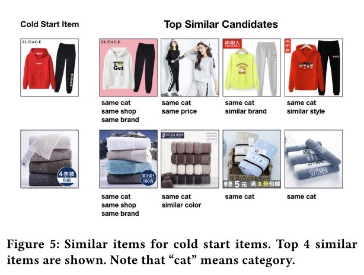
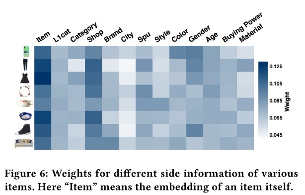
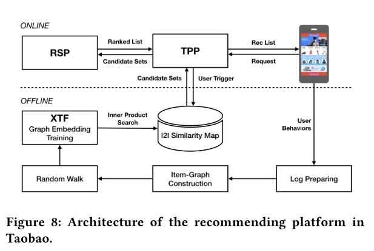

##############################################################################
Billion-scale Commodity Embedding for E-commerce Recommendation in Alibaba
##############################################################################

作者： jizhe Wang, Pipei Huang（黄丕培）. （见 `万物皆向量——双十一淘宝首页个性化推荐背后的秘密 <https://www.infoq.cn/article/dtlzivn21zhlxykycxua>`_）

大名鼎鼎的 EGES. 淘宝主要面临3个挑战： scalability, sparsity, cold-start. 这篇文章就要解决这3个问题。

**文章亮点**

1. 介绍了一种 GE 方法，可以大规模应用，对 GE 以及推荐系统 中常见的 稀疏、冷启 问题都有一定解决
2. 介绍了 Taobao 线上实际的部署方法，值得一看

==========================
1. 概述
==========================

GMV: Gross Merchandise Volume （总成交额）

Double-Eleven Day: 双11

Taobao： 

是 C2C 平台；淘宝有 10 亿用户， 20 亿 items (commodities). 贡献阿里 75% 的流量；

最主要的问题，让用户快速找到需要的、感兴趣的商品！ 推荐是其中的关键技术。 手机淘宝主页基于用户历史行为生成，占据推荐流量的40%； 推荐贡献了最要的营收(revenue)和流量。

Scalability: 在 10 亿用户 20 亿物品前，很多推荐方法不好使；

Sparsity: 用户只与部分 item 有行为。

Cold-Start: 每小时，有百万级别的新 item 被上传到系统；这些 item 没有用户行为；处理这些物料，或者将这些物料推荐给 用户，是一个困难的事情。

使用 matcing -> ranking 二阶段策略；
matching 是给用户有行为的 item，生成1个相似 item 候选；
ranking 基于用户的偏好，用 DNN 排序候选 commodities.
每阶段面对不同的问题，有不同的技术解决方式。

这篇文章主要关注 matching 阶段！

CF 的方法，主要考虑用户历史中，物品间的 co-occurence. 这里用 item 图上的 random-walk, 可以 items 间的高阶相似； 这被称为 BGE (Base Graph Embedding).

BGE 比 CF 强，但是依然解决不了只有很少行为甚至没有行为的 item；为了解决这个问题，因而提出了利用 side-information 提升 Emb 生成的方式，即 GES (Graph Embedding with Side information)。

又，淘宝的商品有很多种类型的 side information, 例如 类别、品牌、价格等； 经验性地，不同类型的 side information 对 commodities emb 贡献不同，因此有必要在 side information 上考虑加权； 这种模型被称为 EGES (Enhanced Graph Embedding with Side information)

总结，在 matching 阶段，有 3 个重点工作：

1. 基于用户行为，构建 item graph
2. 学习 item embedding (EGES, GES 优于 BGE)
3. 部署 graph embedding system.  (在自研的 Xensorflow 上)

==========================
2. 方法
==========================

2.1 构建 item graph
~~~~~~~~~~~~~~~~~~~~~~~~~~

图是 加权有向 图；

1.  将用户连续的行为，拆分为 session-based behaviour.

    将连续的用户行为，按 1 个小时为 window 拆分为多个 session.

    Why: a. 如果不拆分，序列太长，计算、存储开销大
    b. 用户的兴趣随时间有漂移

    其实这里觉得细节还不是太清楚——
    
    拆分为多个 session，应该是每个 session 都会用吧？而不是只用最近1个小时的？
    - 如果是每个 session 都用，那这个相比用整个行为序列，也不能减少多少计算、存储开销？
    - 但只有那个最后1个 session，想想还是不太可能……
    - 应该是用全不的 session； 
    - 切分为 session，相比不切，按照后面的构建边的方式，其实就是少了跨 session 的边；
    这种量，可能积累起来还是比较多的吧——毕竟会有很多个 1 个小时切分；

    拆分的起始时间是统一的，还是基于每个用户的行为序列的起始时间？或者是结束时间（当前时间倒推）？
    - 应该是基于每个行为序列的起始时间？相比倒推，这样能够保证每次计算都是一致的结果；
    - 其实时间统一，不太现实，也没必要？

2.  基于 session-based behaviour, 在 图中连有向边。 如 序列是 A D B. 则连边 A -> D; D -> B;

3.  计算每条边的权重： 就是这条边被连了多少次。 
    
    这样，图上的每条边，其实是全部用户行为的表现。

需要过滤掉一些噪声数据：

1. stay after click less than 1s
2. spam user (3 个月内买 1,000 个 item，或者点了超过 3,500 的用户)
3. item 的 id 没变，但是零售商把其内容大幅改变了

2.2 计算 emb
~~~~~~~~~~~~~~~~~~~~~~~~~~~~~

2.2.1 方法1： BGE
+++++++++++++++++++++++

就是利用 DeepWalk 方式来构建 Emb；

具体地：

1.  随机游走，得到 item 序列 数据集

    随机游走方式：论文里没有详细描述，只说了

    从1个节点到另一个节点的概率：

    .. math::

        p(v_j | v_i)) = \begin{cases}
            \frac {M_{i, j}} {\sum_{j\in N_+{(v_i)}} M_{i,j}}, & v_j \in N_+(v_i) \\
            0, & e_{ij} \notin E
        \end{cases}

        很简单，就是有边的就按归一化权重走；没边的不走；

    但是 1. 如何选起始节点 2. 路径长度 3. 总共生成多少个

    没有细说 => 在后面的实验中，有提到。

2.  得到 item 的序列 数据集后，直接用 word2vec 的 Skip-Gram + negative-sampling 
    (图里面画的是 smapled softmax, 可能差别没有那么大)模式训练即可。

2.2.2 方式2： GES
+++++++++++++++++++++++

BGE 没法处理冷启动问题；需要考虑 side information.

编码也非常简单——每个 side-information 和 item id 一样的等同对待，one-hot => 映射为 d 维的向量 
=> avg pooling, 就得到了 item 的表示向量。 

训练方式依然保持不变。

2.2.3 EGES
+++++++++++++++++++++++

BGE 只是简单的把各个 side-information 平均起来，一个简单的优化就是加权求和。

权重怎么定义？ 有如下候选可以考量：

1. 是 1 个 side-information 定义1个固定权重？ 这样显然表现能力有限
2. 是每个物品的每个 side-information 都对应 1 个权重？ 这样显然很稀疏
3. 还是用 `attention` 思想，定义1个 weight 向量，通过与各个 side-information 向量交互得到权重？看起来不错。

然而，论文用的方法2…… 论文里说，申请了一个 A matrix, shape是 :math:`|V| \times (n +１)`，　
其中　``n`` 就是 side-information 个数，``+ 1`` 是因为还有 item-id 的这个域；``|V|`` 就是图里 vertex 个数，也就是 item 的个数了。 

    不用 attention 的方式来做，我觉得是不太好的…… 说白了，这里没有用矩阵分解（即 attention）来算权重，
    而是独立的标量，对泛化可能会有很大的影响 —— 且不说过拟合，就是你后面对冷启动物品，怎么得到side-information的权重呢？

    从后文来看，对冷启动物品，是直接取的 average, 不说简单粗暴，至少也是退化到 GES 了，与 EGES 框架就不搭了。

    考虑到 2017 年， NLP 里的 attention 早就用烂了，这里没有任何说明，还是值得 argue 的。

    :math:`rightarrow` 事实上，在文章最后的 Future Work 里，利用 Attention 就是未来的工作……

加权求和，需要对权重先做归一化（和为1）。论文里权重归一化用的是 `softmax` :math:`e^{a_{v}^{j}}` ； 
论文里说这是为了保证每个 side-information 权重都大于0（的确！）

> 论文没有点明用的是 softmax 归一化, 但是从公式来看确实是。

===========================
3. 实验
===========================

用于验证效果的方法：

1. link prediction task (offline Evaluation)
2. online experimental result on Mobile Taobao App. 
3. some real-world cases

3.1 link prediction task (offline Eval)
~~~~~~~~~~~~~~~~~~~~~~~~~~~~~~~~~~~~~~~~~~~~~~~~

link prediction 是网络中的基础问题，所以用作离线实验。

**任务定义** 

从图中，随机抹掉一些边，然后预测边是否存在。

细节： 1. 1/3 的边被随机抹掉，作为测试集（的正例）；剩余的边作为训练集； 2. 相同数量的无边的节点对被随机选中作为测试集的负例。

    这个地方学习了！ 可以看到，所有 node （item） 都被放到训练、测试集中，而边才是预测对象（定义在物品与物品间的行为交互）。
    测试集选取为1:1 的正负例。

评价指标： AUC (Area Under Curve)

**数据集**

有2个数据集，

============== ============ ============ ============ ====================================================
Dataset         #Nodes      #Edges         #SI          Sparcity(%, 1 - #Edge / (#Nodes x (#Nodes - 1)))
============== ============ ============ ============ ====================================================
Amazon          300 K        3.7 M           3            99.6%
Taobao          2.6 M        45.0 M         12            99.9%
============== ============ ============ ============ ====================================================

> 原论文Spacity应该少乘了 100% 吧……

1.  Amazon Electronics, denoted by Amazon in *Image-based recommendations on styles and substitutes. SIGIR, 2015*

    基于 co-purchasing (also-bought) 来构建边； 共有 3 种 side-information: category, sub-category, brand.

2.  Taobao，从 Taobao Mobile 上抽取的数据。

    基于前面提到的行为 session 来构建边； side-information 有12种，包含 brand, retailer, gender, age, style, 
    purchase-level 等；

两个数据构成的图，都是很稀疏的！稀疏率都是 99+%, 边的数量大概是节点量的 10 倍以上。

**对比方法**

====== ========
Method Remark
====== ========
BGE    前面提到的基础方法
LINE   *Line: Large-scale information network embedding, WWW, 2015*, 
       使用1阶和二阶邻居来计算 Emb； 分别记为 LINE(1st), LINE(2st)
GES    用了 side-informaction 的 GE
EGES   加权的 GES
====== ========

LINE 用的原始论文实现，其他都是自己实现。

**参数设置**

emb 维度都设为 160; 

对 BGE, GES, EGES 中的随机游走，游走长度设为 10， 每个节点游走 20 次；训练 emb 时， context-window 
（应该就是negtive-sampling 时正例选择的窗口）设为 5； 

**结论**

表就不 copy 了，BGE 在两个数据集上都最差； LINE 在 Amazon 上和 GES 基本接近，在 Taobao 上差 3 个点。

EGES自然都是最好的，但是在 Amazon 较显著优于 GES，但在 Taobao 相比 GES 差别不大。

Taobao 上， GES 相比 BGE 高 10 个点，说明 side-information 还是有用的 —— 论文里说解决了稀疏性问题。

Amazon 上的提升， GES 相比 BGE 只有 2 个点，这说明 side-information 较少时提升有限；但是 EGES 相比 GES 提升了1个多点，
说明 side-information 不充分时，用加权的方式，能够获得更好的提升。

    感觉说这个说法，有道理也没道理。

    有道理的是，加权毕竟表达能力更好，当side-information 少时，表达能力受限，这时加上加权，表达能力可能就上去了。
    
    没道理的是，既然 side-information 少，那岂不是加权的意义也没那么大？ 至少不该好于 12 个 side-information ？ 
    这种结论，说白了都是基于结果倒推，意义没有那么大。 work 就行吧。

3.2 在线 A/BTest
~~~~~~~~~~~~~~~~~~~~~~~~~~~~~~~~~~~~~~~~~~

**方法**

基于 Item 的 Embedding， 计算每个 item 的 相似item， 输入到排序模型，作为 Taobao Mobile 主页推荐的结果。

相似结果的好坏，直接影响到推荐结果！

    没有说每个 item 要生成多少个相似 item，也没有说这套系统在实验过程中，Emb 是不是根据行为、新上传 item 实时更新的。
    我觉得这两点应该挺重要的。

**对比方法**

====== =======
Method  Remark
====== =======
Base   Item-CF 的方法，考虑了物品的（在行为中的）共现，以及用户的voting weight.
       这套方法在 GE 应用前在淘宝大规模应用，用了很多人工启发式的规则（主要用来计算 user voting weight?）。
BGE 
GES
EGES
====== =======

各个方法出来结果后，用的是一套 rank .

**实验设置**

使用 CTR 作为指标。

实验做了 7 天，做实验的时间是 2017 年 11 月。

**效果**

Base 好于 BGE; EGES > GES >　Ｂase;

3.3 Case Study
~~~~~~~~~~~~~~~~~~~~~~~~~~~

研究的是 EGES 的向量表现。

3.3.1 向量可视化
+++++++++++++++++++++++++++

把鞋子的 Embedding，用 `projector-tensorflow <https://projector.tensorflow.org/>`_ 来可视化(PCA 方式)。

可以看到，不同 category 的鞋子，分属于不同的聚类（说明 category 对应的向量，在加权后的整体向量里还是挺有影响力的）；

进一步的，发现 badminton 和 table tennis 聚类很接近，与 football 较远。作者分析说，这表示中国人里，
喜欢 羽毛球 和 乒乓球 的人有较大的重叠；而喜欢足球的人，与喜欢羽毛球、乒乓球这些室内运动的人重叠很少。

> 挺有意思的！

3.3.2 冷启动物品效果
+++++++++++++++++++++++++++

**如果构建 冷启动物品 向量？**

非常简单，把冷启动物品的各 side-information 对应的 emb， 平均一下，就是冷启动物品的向量表示了。

**效果**

论文里看了 2 个case的效果：分别选了属于衣服和毛巾的一个商品，查看 Top4 相似的商品。看起来效果还是很好的，如论文截图：

基于该图中找到的相似 item 与冷启动 item 具有的相似属性， shop 这个 SI 的影响比较大。论文说这是因为 item 的 SI 中，shop 的权重
比较高（下一节会分析），对 item 的最终表示影响较大，因而在 冷启动物品 找相似的过程中，shop 的影响也较大
（因为冷启物品的表示是各个 SI 的平均，而其他训练过的 item shop 的 SI 权重高，那自然在向量匹配时， shop 的影响就大了）。

3.3.3 EGES 中各 SI 权重
+++++++++++++++++++++++++++++

作者从 8 个 category 中各找了 1 种物品，可视化了 SI 的权重分布，如下图：

作者据此图给出了 3 点观察和分析：

1. 各个物品的 SI 权重分布都是不同的，这印证了论文的假设： 不同物品的 SI 贡献不同。
2. item-id 在各个物品中的权重都是最高的，这说明：item-id 对应的 item 本身才是用户行为的关键，而 SI 只是辅助。
   —— 不过，离开了这个辅助，也就是 BGE， 效果就没有那么好了。
3. 所有物品中， SI shop 是除 item-id 外权重最高的，这与用户的行为相一致： 用户倾向于买同店铺的东西，因为方便和便宜（满减优惠？）

    分析还是很好的。

==========================
4. 系统部署与操作
==========================

**整体框图**

:TPP: Taobao Personality Platform.

:RSP: Ranking Service Platform.

:XTF: 基于Porsche blink的分布式Tensorflow训练及在线打分平台 (来自 `一天造出10亿个淘宝首页，阿里工程师如何实现？`_)

从现在的视角来看，比较常规的图：分为 在线、离线 两个部分。在线部分处理实时请求，离线部分计算、更新向量。

**在线部分**

从用户进入 Taobao Mobile App 开始，TPP 拉取用户最新的信息（应该就是行为历史），从 offline-subsystem 中获取候选 items；
然后交给 RSP 排序（基于 DNN 的），最后返回给用户。

    这里需要关注的点，就是拉取相似 item 的计算，从图中来看，应该就是读的缓存（例如 Redis）。 不确定实际中或者现在是否是实时计算的。

**离线部分**

这里就是体现 EGES 实际上线部署的工作了。

1.  处理用户行为日志： 一般拉近 3 个月的，然后左 anti-spam 处理，剩余的大概有 600 billion 的 entries.
2.  构建图和随机游走序列： 因为数据太多，因此实际中，不是放大 1 个图里，
    而是利用 Open Data Processing Service (ODPS) 并行处理拆分后的子图。
    子图大概 50 million 的 nodes. (即 5 千万的物品)。 每个子图上，基于 ODPS 的 iteration-based distributed graph framework
    来生成随机游走序列。

    所有序列生成后，共有大约 150 billion 的序列。
3.  训练 emb: 基于 XTF，用 100 块 GPU 训练。

整体上，共有 ``获取日志`` :math:`\rightarrow` ``anti-spam处理`` :math:`\rightarrow` ``item-graph构建`` :math:`\rightarrow`
``随机游走-序列生成`` :math:`\rightarrow` ``训练embedding`` :math:`\rightarrow` ``item2item 相似计算`` :math:`\rightarrow`
``生成 I2I map`` 这些步骤，作者说可以在少于 6 小时的时间内全部完成。

    这大概就是算法和强大工程结合的魅力。 有一些小疑惑：

    1. 是否每隔一段时间（例如这里是 6 小时），就全量算一遍？
    2. 冷启 item 生成 emb ，是另一个独立的过程在做？ 还是说只在全量更新里完成。 

==========================
5. 相关工作
==========================

5.1 Graph-Embedding
~~~~~~~~~~~~~~~~~~~~~~~~~~~~~~~~~~~~~~~~~~~~~~~

GE 是一种通用的 **网络表示(Network Representation)** 的方法！

可以分为 3 类工作，

1.  因子分解方法

    LINE 是其中的代表。

2.  深度学习的方法

    *Deep neural networks for learning graph representations， AAAI 2016*

    *Transnet: Translation-based network representation learning for social relation extraction. IJCAI 2017*

    *Structural deep network embedding. KDD 2016*

3.  随机游走的方法

    *metapath2vec: Scalable representation learning for heterogeneous networks. KDD 2017*

    *Node2vec: Scalable feature learning for networks. KDD2016*

    *Deepwalk: Online learning of social representations. KDD 2014*

5.2 Graph-Embedding with side-information
~~~~~~~~~~~~~~~~~~~~~~~~~~~~~~~~~~~~~~~~~~~~~~~

GE 只利用了图的拓扑结构信息，存在 稀疏、冷启动 问题。利用 side-information 是一种今年来尝试提升 GE 表示的方式。

主要的出发点是，如果一些节点有相同的 side-information, 那么他们应该在向量空间中相近。

一些工作：

1.  多任务学习：联合 embedding 任务和分类任务

    *Discriminative deep random walk for network classification. ACL 2016*

    *Max-margin deepwalk: Discriminative learning of network representation. IJCAI 2016*

2.  使用知识图谱、文本、图片信息

    *Representation learning of knowledge graphs with hierarchical types. IJCAI 2016*

    *Cane: Context-aware network embedding for relation modeling. ACL 2017*

    *Text-enhanced representation learning for knowledge graph. IJCAI 2016*

    *Network representation learning with rich text information. IJCAI 2015*

    *Incorporating knowledge graph embeddings into topic modeling. AAAI 2017*

    *Heterogeneous network embedding via deep architectures. KDD 2015*

5.3 Graph-Embedding for Recommendation System
~~~~~~~~~~~~~~~~~~~~~~~~~~~~~~~~~~~~~~~~~~~~~~~~~~~~

推荐系统已经成为 GE 最流行的下游任务之一。

一些工作：

*Personalized entity recommendation: A heterogeneous information network approach. WSDM 2014*

*Collaborative knowledge base embedding for recommender systems. KDD 2016*

*Meta-graph based recommendation fusion over heterogeneous information networks. KDD 2017*

*Scalable graph embedding for asymmetric proximity. AAAI 2017*

==========================
6. Future Work
==========================

2 个方向：

1. 利用 `attention` 机制，更好的加权不同的 SI
2. 将 文本信息 加入到网络， 更好地利用大量用户的评论。 

.. _`一天造出10亿个淘宝首页，阿里工程师如何实现？`: https://zhuanlan.zhihu.com/p/32183684
